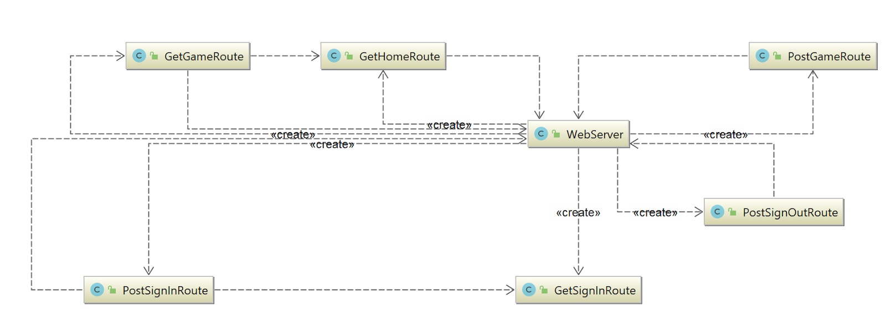
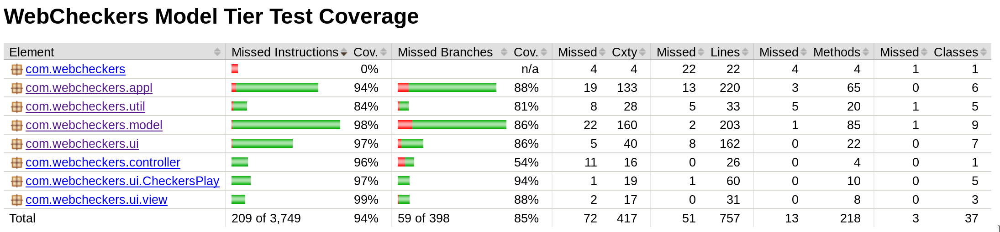
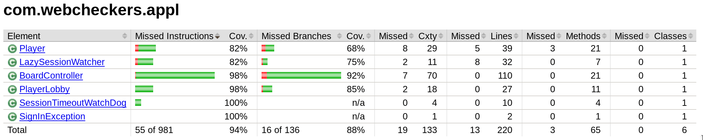
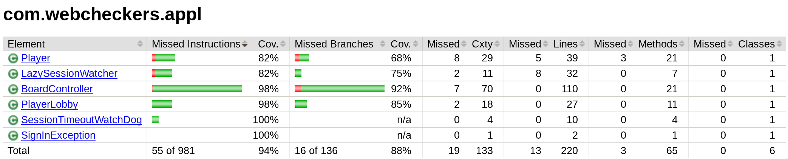
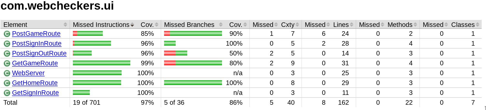
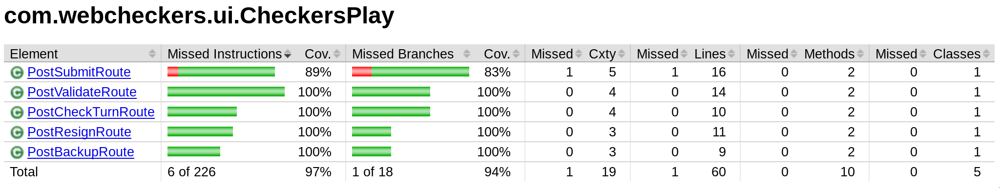
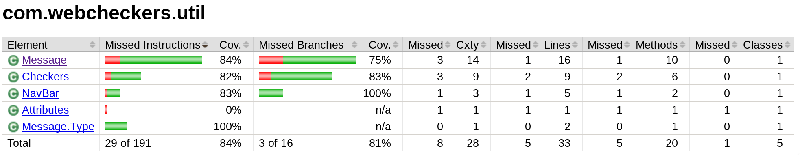

# PROJECT Design Documentation

## Team Information
* Team name: 2185-swen-261-04-d-damns
* Team members
  * Dylan Cuprewich
  * Abhaya Tamrakar
  * Mike Bianconi
  * Nicholas Chieppa
  * Suwamik Paul

## Executive Summary

### Purpose
WebCheckers allows users to connect with a server and play against each other at an online game of Checkers.

### Glossary and Acronyms

| Term | Definition |
|------|------------|
| VO | Value Object |
| MVP | Minimum Viable Product |
| Spark | Java-based Server API |
| FreeMarker | Java-generated HTML API |
| Ajax | Allows asynchronous server requests |

## Requirements

This section describes the features of the application.

The major features of the application include being able to signin with the name of your choosing, being able to select the player you want to challenge, move your own pieces, capture enemy pieces, beat your opponent, lose to your opponent, and resign to your opponent.

### Definition of MVP
The MVP includes every player being sign-in before playing a game and being sign-out when the game is finished, the players must play according to the American rules of Checkers, and allowing players to resign at any point to end the game.

### MVP Features
Stories/Epics involved in completion of the MVP:
  * Lose
  * Win condition
  * Move
  * Perform turn
  * Jump
  * Resign
  * King
  * Sign-in
  * Start a Game
  
### Roadmap of Enhancements
* We have developed an AI that a user can play against replacing a human opponent. 
* We have also developed a "Spectator" mode where a third user could watch a match occuring 
between two other players without having the ability to play.
* Lastly, we have added a third enhancement where a user could watch the replay of the match,
meaning the user could simulated the game that was previously played and can control what to 
watch- next move, previous move.

## Application Domain

This section describes the application domain.

The main component of the domain model is the WebCheckers game. It is built up of smaller entities such as the players and the board. A player represents the user who is playing the game of WebCheckers and the board is the field on which the game is played on. The board is composed of 64 tiles on which the pieces are placed.  Each player can move one of their 24 pieces per turn, this move must follow the rules. This move can either be moving a piece forward or jumping and capturing an opponent’s piece. The piece can either be a standard piece or an upgraded king which follows a different moving ruleset.

## Architecture and Design

This section describes the application architecture.

### Summary

The following Tiers/Layers model shows a high-level view of the webapp's architecture.

As a web application, the user interacts with the system using a
browser.  The client-side of the UI is composed of HTML pages with
some minimal CSS for styling the page.  There is also some JavaScript
that has been provided to the team by the architect.

The server-side tiers include the UI Tier that is composed of UI Controllers and Views.
Controllers are built using the Spark framework and View are built using the FreeMarker framework.  The Application and Model tiers are built using plain-old Java objects (POJOs).

Details of the components within these tiers are supplied below.

### Overview of User Interface

This section describes the web interface flow; this is how the user views and interacts
with the WebCheckers application.

When you connect to the server, you first render to the home page. This Home page displays the players that are online in the lobby. You will have the option to sign in. When you click the sign in button, you render to the sign in page. 
In the sign in page, you are prompted to enter a username to join other players in the home page. If you enter a valid username, you are rendered back to the home page. If it an invalid name, you are prompted to enter the name again.
Once you are signed in and waiting in the home page, if you are challenged or if you challenge another player and they accept, you are sent to the game.
If you want to play against the AI, you can simply click on the AI and play against it.
If you want to spectate a game, simply clicking on the player under the "spectate" header will put you under spectate mode.
And finally, you can click on a game under the "replay" header to watch the replay.
You may sign out after playing a game and you render back to the home page.

### UI Tier
The UI tier contains classes that allow users to make web requests and therefore allows for user interaction. The UI tier is responsible for using model, application, and session data to generate dynamic webpages that respond to changes in the programs state. The UI tier, therefore, is also responsible for the handling of any AJAX calls that a users browser may send. 

The UI tier is built by the `Webserver` class when the application starts. When building the `Webserver` maps all the classes in this tier labeled 'Route' to different URLs. All Route classes implement the SparkJava interface `Route` which allows these classes to handle web requests and generate webpages for end-users. 

The UI tier handles events for gameplay. Above depicts the sequence that is executed when a player asks the server to submit a move for validation. When a player makes a move it must be validated on the server to ensure the move follows the rules of checkers.

Above depicts the average expected sequence for any particular checkers turn. When a player takes a turn they are expected to make a number of moves, then submit there turn for validation. The turn is either rejected or the moves are performed on the board.

### Application Tier
The Application Tier holds the main interfaces between the Model Tier
and users. It contains Players and PlayerLobbies, which allows users
to sign in and play against other users. It also holds the
BoardController, which takes in moves from Players and updates the
Model's Board accordingly.

Additionally, the Application tier also holds Chinook, our implementation
of an AI. Chinook extends the Player class and simply sits in the lobby
waiting to be challenged. When playing, Chinook will recursively check
every jump available and assign each a score using a ScoredMoveList. It
then plays the highest-scored route.

### Model Tier
The Model Tier holds the most basic features of WebCheckers. It contains
the Board, Pieces, etc. It has few dependencies on classes outside of
its package. Board holds an array of Spaces, each of which may hold a
Piece. The Model Tier only holds the most basic access methods and
defers to the Application Tier's BoardController class to deal with
Player Moves. Outside of classes, the Model Tier also contains an
enum for holding GameState (RED WINS, WHITE WINS, or IN PROGRESS).

### Design Improvements
Moving forward, we should clean up BoardController and possibly split
it into several smaller classes. Right now, it has much more
functionality than is appropriate for one class. It may make more
sense to split it into BoardController and MoveValidator classes.
In that vein, we need to refactor several methods directly into
Move, Piece, etc.

## Testing
This section provides information about the testing performed
and the results of the testing

### Acceptance Testing
Currently, there are 5 user stories that have passed all their acceptance
criteria tests. This includes sign-in, start a game, move, capture and king
There are currently 3 user stories that are part of the MVP,
that have yet to be tested because they have not been fully implemented. 
These are jump, resign and rematch. The enhancements have not been implemented either
and thus not been tests.
There hasn't been any failures and likewise any concerns.

### Unit Testing and Code Coverage
Our strategy for unit testing the code was very straight forward. We decided that the members who weren't much involved with implementing the MVP were to test the code. We divided the testing into different parts based on the tiers- Application, Model, UI and also including util, which is our utility class. 
The code coverage target for our initial MVP was atleast 90%. After finishing most of the testing, our code coverage, generated using jacoco, turned out to be 94% which was a satisfactory result. 
After we finished all our enhancements, we had to re-test few components of our code. Our target for the final project was 95% code coverage and we were able to accomplish it. We are very proud of achievement.

### Code Metrics 

WIP

### Code Coverage Results

#### Overall Tiers

#### Application Tier

#### Model Tier

#### UI Tier

#### Checkersplay  Sub-Tier

#### Util Tier

