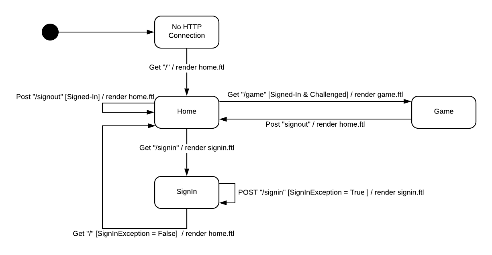

# PROJECT Design Documentation

> _The following template provides the headings for your Design
> Documentation.  As you edit each section make sure you remove these
> commentary 'blockquotes'; the lines that start with a > character
> and appear in the generated PDF in italics._

## Team Information
* Team name: Damns
* Team members
  * Dylan Cuprewich
  * Abhaya Tamrakar
  * Mike Bianconi
  * Nicholas Chieppa
  * Suwamik Paul

## Executive Summary

### Purpose
WebCheckers allows users to connect with a server and play against each other at an online game of Checkers.

### Glossary and Acronyms

| Term | Definition |
|------|------------|
| VO | Value Object |
| MVP | Minimum Viable Product |
| Spark | Java-based Server API |
| FreeMarker | Java-generated HTML API |
| Ajax | Allows asynchronous server requests |

## Requirements

This section describes the features of the application.

> _In this section you do not need to be exhaustive and list every
> story.  Focus on top-level features from the Vision document and
> maybe Epics and critical Stories._

### Definition of MVP
> _Provide a simple description of the Minimum Viable Product._

### MVP Features
> _Provide a list of top-level Epics and/or Stories of the MVP._

### Roadmap of Enhancements
> _Provide a list of top-level features in the order you plan to consider them._

## Application Domain

This section describes the application domain.

The main component of the the domain model is the WebCheckers game. It is built up of smaller entities such as the players and the board. A player represents the user who is playing the game of WebCheckers and the board is the field on which the game is played on. The board is composed of 64 tiles on which the pieces are placed on.  Each player can move one of their 24 pieces per turn, this move must follow the rules. This move can either be moving a piece forward or jumping and capturing an opponent’s piece. The piece can either be a standard piece or an upgraded king which follows a different moving ruleset.

## Architecture and Design

This section describes the application architecture.

### Summary

The following Tiers/Layers model shows a high-level view of the webapp's architecture.

As a web application, the user interacts with the system using a
browser.  The client-side of the UI is composed of HTML pages with
some minimal CSS for styling the page.  There is also some JavaScript
that has been provided to the team by the architect.

The server-side tiers include the UI Tier that is composed of UI Controllers and Views.
Controllers are built using the Spark framework and View are built using the FreeMarker framework.  The Application and Model tiers are built using plain-old Java objects (POJOs).

Details of the components within these tiers are supplied below.

### Overview of User Interface

This section describes the web interface flow; this is how the user views and interacts
with the WebCheckers application.

When you connect to the server, you first render to the home page. This Home page displays the players that are online in the lobby. You will have the option to sign in. When you click the sign in button, you render to the sign in page. 
In the sign in page, you are prompted to enter a username to join other players in the home page. If you enter a valid username, you are rendered back to the home page. If it an invalid name, you are prompted to enter the name again.
Once you are signed in and waiting in the home page, if you are challenged or if you challenge another player and they accept, you are sent to the game.
You may sign out after playing the game and you render back to the home page.

### UI Tier
> _Provide a summary of the Server-side UI tier of your architecture.
> Describe the types of components in the tier and describe their
> responsibilities.  This should be a narrative description, i.e. it has
> a flow or "story line" that the reader can follow._

> _At appropriate places as part of this narrative provide one or more
> static models (UML class structure or object diagrams) with some
> details such as critical attributes and methods._

> _You must also provide any dynamic models, such as statechart and
> sequence diagrams, as is relevant to a particular aspect of the design
> that you are describing.  For example, in WebCheckers you might create
> a sequence diagram of the `POST /validateMove` HTTP request processing
> or you might show a statechart diagram if the Game component uses a
> state machine to manage the game._

> _If a dynamic model, such as a statechart describes a feature that is
> not mostly in this tier and cuts across multiple tiers, you can
> consider placing the narrative description of that feature in a
> separate section for describing significant features. Place this after
> you describe the design of the three tiers._

### Application Tier
The Application Tier holds the main interfaces between the Model Tier
and users. It contains Players and PlayerLobbies, which allows users
to sign in and player against other users. It also holds the
BoardController, which takes in moves from Players and updates the
Model's Board accordingly.

### Model Tier
The Model Tier holds the most basic features of WebCheckers. It contains
the Board, Pieces, etc. It has few dependencies on classes outside of
its package. Board holds an array of Spaces, each of which may hold a
Piece. The Model Tier only holds the most basic access methods, and
defers to the Application Tier's BoardController class to deal with
Player Moves.

### Design Improvements
> _Discuss design improvements that you would make if the project were
> to continue. These improvement should be based on your direct
> analysis of where there are problems in the code base which could be
> addressed with design changes, and describe those suggested design
> improvements. After completion of the Code metrics exercise, you
> will also discuss the resutling metric measurements.  Indicate the
> hot spots the metrics identified in your code base, and your
> suggested design improvements to address those hot spots._

## Testing
> _This section will provide information about the testing performed
> and the results of the testing._

### Acceptance Testing
> _Report on the number of user stories that have passed all their
> acceptance criteria tests, the number that have some acceptance
> criteria tests failing, and the number of user stories that
> have not had any testing yet. Highlight the issues found during
> acceptance testing and if there are any concerns._

### Unit Testing and Code Coverage
> _Discuss your unit testing strategy. Report on the code coverage
> achieved from unit testing of the code base. Discuss the team's
> coverage targets, why you selected those values, and how well your
> code coverage met your targets. If there are any anomalies, discuss
> those._
